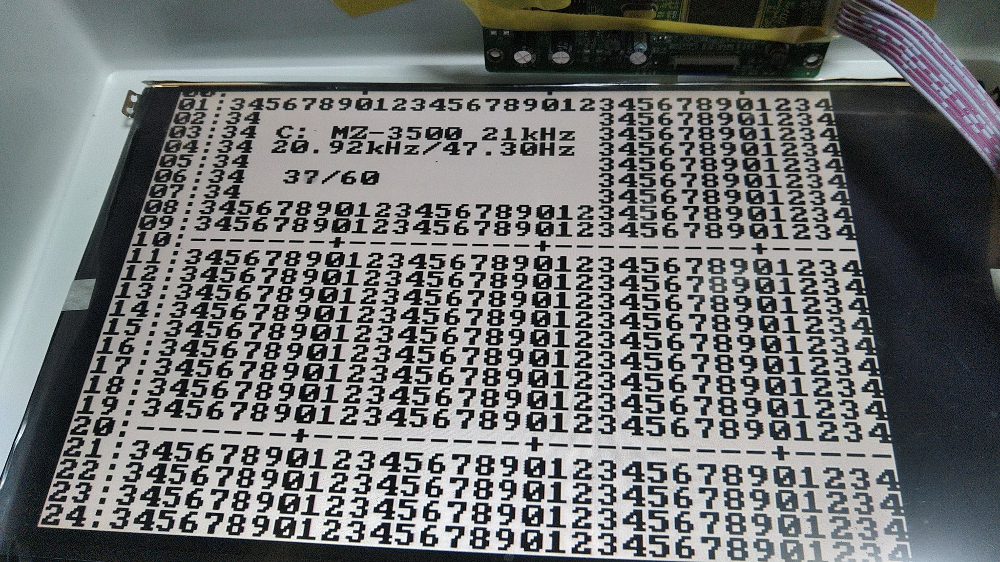
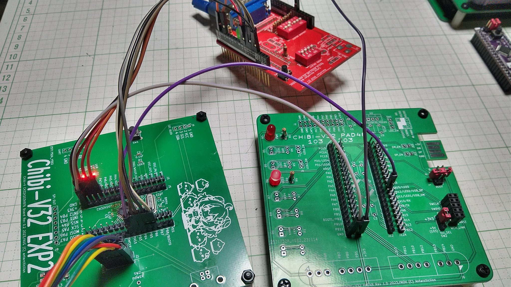

# RetroVGen-for-CH32V203
Retro RGB Video Signal Generator for CH32V203K8T6/CH32V20CK8T6  

    2023-11-25 copyright (c) antarcticlion  

    https://github.com/antarcticlion/RetroVGen-for-CH32V203/  

	Origin with  
		GORRY - RetroVGen  
		Nick Gammon - VGA video generation  
  
----  

----  
  
GORRYさんのRetroVGenをCH32V203に移植したものです。  
ビルドにはarduino ideにWCHのボードをインストールしたものが必要です。  
  
R.01の時点ではオリジナルとは以下の点が異なっています。  
　・スクリーンモードを5つ追加。  
　・144MHzで動作するCH32V203ではペリフェラルクロックが9MHzの倍数になるため各種タイミングは若干の差異があります。  
  
まだ作業中のため、NTSC/PALは動作不可です。  
ファーストリリースはオリジナルを知っている人向けの説明しかしませんが、詳しい解説は後日書きたいと思います。  
  
現時点でオリジナルRetroVGenとほぼ同等の動作をします。  
詳しい説明はGORRYさんのオリジナルの方を見てください。  
https://gorry.haun.org/pw/?RetroVGen  
  
----  
  
note:  
8MHzのクリスタルがPD0/PD1につながっていてHSEで動作することが必要です。  
  
  
　システムのコードを HSE 144MHz 設定に、HSE timeout値を 0x1000 から 0x4000に変更する必要があります。  
  具体的に変更する2カ所を示します。  
  windowsでの例です。OSやインストール先に合わせて読み替えてください。  
    
① ユーザー名\AppData\Local\Arduino15\packages\WCH\hardware\ch32v\1.0.3\system\CH32V20x\USER\system_ch32v20x.c の  
  
  #define SYSCLK_FREQ_144MHz_HSE  144000000  
  
　を有効にする（他のクロック設定を無効にする）。  
   
② ユーザー名\AppData\Local\Arduino15\packages\WCH\hardware\ch32v\1.0.3\system\CH32V20x\SRC\Peripheral\inc\ch32v20x.h の  
  
  #define HSE_STARTUP_TIMEOUT    ((uint16_t)0x1000) /* Time out for HSE start up */  
  
  を  
  
  #define HSE_STARTUP_TIMEOUT    ((uint16_t)0x4000) /* Time out for HSE start up */  
  
  に書き換えてください。  
  
----  
  
ライセンス / LICENSE  
  
このプロジェクトはフルスクラッチで書かれたファイルとGORRY氏作のRetroVGenのファイルを改変したものが混在しています。  
プロダクト全体のライセンスを RetroVGen および派生元のNick Gammon氏による「VGA video generation」と揃えます。  
  
 本プロダクトは、自由かつ無償で使用・コピー・配布・変更・流用を行うことが  
 できます。また許可なく再配布・出版・販売を行うことができます。  
   
 本プロダクトは、無保証です。使用した、あるいはしなかったことによる一切の  
 責任は使用者にあるものとします。  
  
----  
have fun :)  
